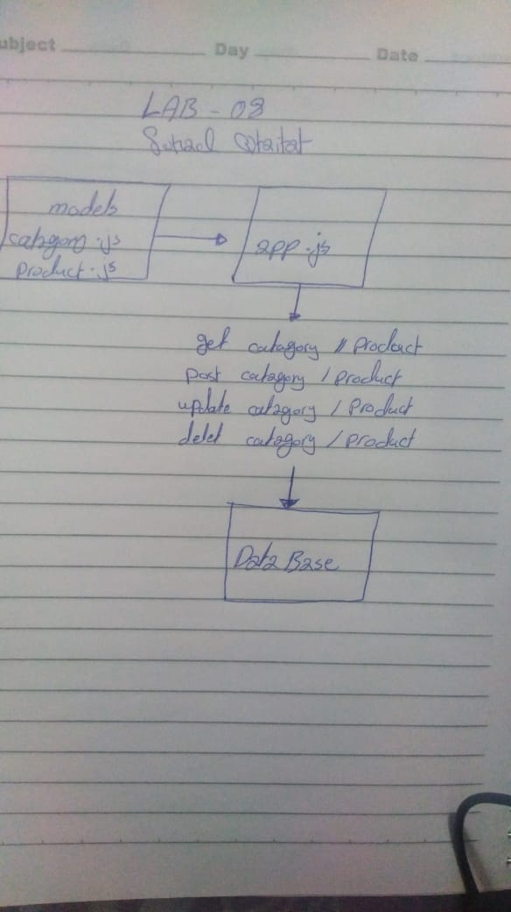

# express-Routing-Connected-APIs
lab8

# LAB - 8

## Project Name
Express Routing &amp; Connected API

### Author: Brad Smialek

### Links and Resources

* [submission PR](http://xyz.com)
* [travis]()

### Modules
#### `categories.js`
#### `products.js`
#### `mongo.js`
#### `router.js`

##### Exported Values and Methods
#### `Class Products`
#### `Class Categories`
#### `Products schema`
#### `Categories schema`
#### `Class Model`
#### `get, post update, delete`
#### `router.js`

### Setup
#### `.env` requirements
* `PORT` - 3000
* `MONGODB_URI` - 'mongodb://localhost:27017/class-08';

#### Running the app
* `nodemon`
* Endpoint:  get `/api/v1/categories`
  
#### Tests
* npm test with jest
* What assertions were made?
* What assertions need to be / should be made?

#### UML

